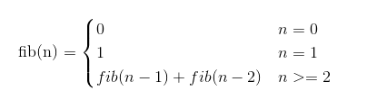
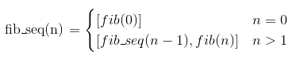

# 关于递归的思考

之前有接触过递归，看到别人写的递归函数的代码，好生羡慕，怎么就能写这么好呢？我怎么就想不到这样写呢？如此等等。

就拿fibonacci函数来说吧，一个普通的函数可能这样写：

```python
def fib(n):
    if n == 0:
        return 0
    elif n == 1:
        return 1
    else:
        return fib(n-1) + fib(n-2)
```

我看到这个函数的思考方式是这样的：

    1. 当n=0时：返回0
    2. 当n=1时：返回1
    3. 当n=2时：
        1. 首先去调用n=1，返回1
        2. 再去调用n=0，返回0
        3. 把0和1相加返回1
    4. 当n=3时：
        1. 调用n=2
            1. 调用n=1，返回1
            2. 调用n=0，返回0
            3. 相加返回1
        2. 调用n=1，返回1
        3. 把1和1相加返回2
    5. 等等

想到这我头都要爆了，彻底被人家的函数折服了，看来我是写不成这么好的函数了。

但我转念一想，这个函数的本质是fibnacci序列，我何不回归fibonacci本身呢？fibonacci用数学公式表示应该是这样：



看到公式我恍然大悟，上面那个函数不就是根据这个公式直接翻译的嘛！原来我一直思考都是顺着函数的代码思考，这样肯定会觉得很难,
正确的思考方式应该是从算法出发然后再写代码。


经过了上面的惨痛教训看看我能不能写出正确的fibonacci序列函数，分段函数的公式应该是这样的：



那么直接写成代码就应该是这样的:

```python
def fib_seq(n):
    seq = []
    if n == 0:
        seq.append(0)
    else:
        seq.extend(fib_seq(n-1))
        seq.append(fib(n))
    return seq
```

咦，这两个append好像可以合并：

```python
def fib_seq(n):
    seq = []
    if n > 0:
        seq.extend(fib_seq(n-1))
    seq.append(fib(n))
    return seq
```

哇，原来如此！
